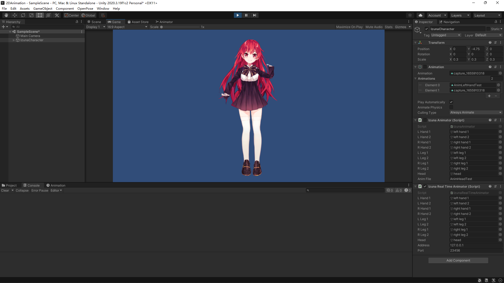
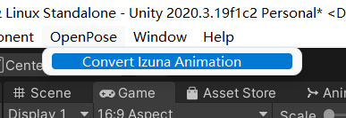

# openpose-jetson-unity-demo




Part of my Hardware Course Project (2022 Spring). A Unity demo of binding pose keypoints to a rigged 2D character.

## Requirements

- Unity 2020.3.19f1c2
- Unity Package
  - 2D Animation 5.0.10
  - 2D PSD Importer 4.1.3

## Usage

Due to the resource license, we cannot provide the art resources for this project. The project requires an `Izuna_Asset.psb` in `Assets/Arts` folder.

### OANIM Convert to Unity AnimationClip

OANIM is an animation format exported by [openpose-jetson-demo](https://github.com/KSkun/openpose-jetson-demo). We provide the converting function from OANIM animation to Unity's legacy [AnimationClip](https://docs.unity3d.com/ScriptReference/AnimationClip.html).



Click the "Convert Izuna Animation" button and select the OANIM file to convert. When completed you will see this in the console.

```
Convert done! Saved at Assets/Animations/xxx.anim
```

And the Unity animation file is available in the same folder as your OANIM file.

*Notice: This tool is designed ONLY for Izuna-chan!'s rigging. Different rigging may cause the animation not working.*

### Real-time Motion Binding

We provide a sample scene as `SampleScene.unity` and a configured `IzunaCharacter`. A script component named `IzunaRealTimeAnimator` is assigned to the character. Change the address (for Jetson Nano it is 192.168.55.1) and port (default 23456) to your [openpose-jetson-demo](https://github.com/KSkun/openpose-jetson-demo) instance and run in the editor, the animator will automatically bind the captured motion to the rigging.

## Resources

- Izuna-chan! 2D Character Model, yunano34a1 (Unity Asset Store), https://assetstore.unity.com/packages/2d/characters/izuna-chan-2d-character-model-195299

Notice: Due to [Unity Asset Store's EULA](https://unity3d.com/legal/as_terms), the resource *Izuna-chan!* is NOT contained in the project. The project will be only used for school project, but not commercial purposes. 